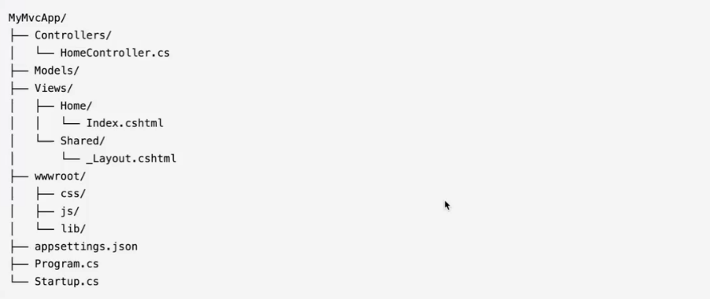
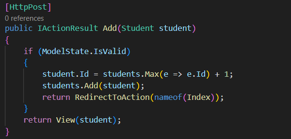
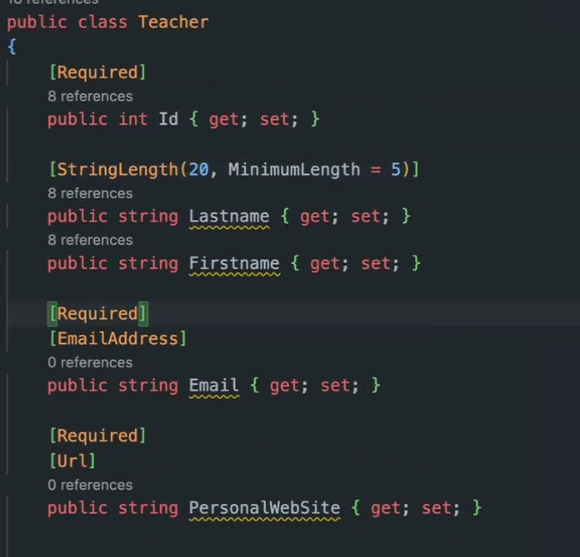

# Cours API .NET

**Instalation de .NET**
https://dotnet.microsoft.com/fr-fr/download

On a le choix entre une version LTS (long term support) ou STS (Standard Term Support).
La version LTS a une durabilité de support de 3 ans et la STS 1.5 an. Les entreprises / Pro utilise généralement la version LTS
pour éviter les monter en version trop régulière.

## Les commandes importante du CLI .NET

**Créer un projet** 
on utilise la commande suivante *dotnet new nom_du_projet -n nom_du_projet -o nom_du_dossier_du_code*

Pour lancer le projet il faut se trouver dans le dossier du projet contenant le fichier en .csproj. Ensuite executer la  commande **dotnet run** cette commande permet l'execution de la compilation et la création des fichiers executables. 

Le fichier .csproj est le fichier qui défini le projet, la "carte d'identité" du projet.

Le premier fichier exécuter lors du lancement du projet, c'est le fichier Program.cs

## Structure de base d'un projet ASP.NET COre MVC

### Explication des dossiers et fichiers clés

- Controllers/ contient les classes contrôleurs 
- Models/ Pour les classes de modèles et la logique métier
- Views/ Contient les fichiers de vue Razzor 
- wwwroot/ Pour les fichiers statiques (CSS, JavaScript ,Images)
- appsettings.json/ Configuration de l'application 
- Program.cs/ Point d'entrée de l'application 
- Startup.cs/ Configuration des services et du pipeline de l'application 

## Controller

Pour faciliter la réutilisation du code on réécrit une classe dans un fichier et ensuite on va l'importer a chaque utilisation de cette classe
on utilise des namespaces dans les classes afin de simplifier l'import de ces classes, ce sont des contenant virtuelles.

voici comment on nomme un namespace : "nomDuProjet.nomDuDossier" par exemple dans notre projet mvc le namespace dans la classe HomeController s'appel mvc.Controller

pour importer une classe, on utilise son namespace en utilisant using. Par exemple : using mvc.Controller.

**Methodes** 
Les methodes de controller en .NET on les appelles des actions

On peut décorer ces méthodes afin d'indiquer ce que l'on attend de notre méthode (Get/Post etc...) Par défaut la methode est en GET.
voici un exemple : 

Pour utiliser ces méthodes dans un formulaire par exemple on n'utilise pas action="" par défaut mais asp-action="nom_de_la_methode".

Pour commenter en html avec la méthode Razzor on utilise cette syntaxe @* Mon commentaire *@

**Modèles** 

On peut ajouter des méthodes de valdation des données afin d'éviter d'entrée de mauvaise donnée dans une base de donnée.
comme ceci: 
Pour ajouter un message d'erreur personalisé : 

## Installation de dépendances tiers

Pour installer des dépendances tiers on utilise NuGet.org qui est le site qui référence le plus de dépendances 

On va tout d'abord installer la dépendance Pomelo, qui permet de connecter une base de donnée MySQL, c'est aussi un ORM 